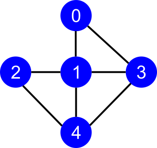
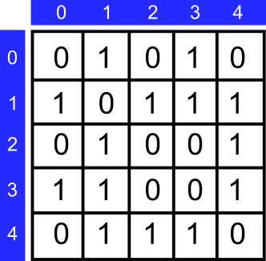

# BFS

> Exemplo de implementação do algorítmo Breadth-First Search (BFS) ou Busca em Largura.

## Introdução

O BFS é um dos mais simples algorítmos para realizar busca em grafos. O objetivo deste algorítmo é explorar sistematicamente as arestas de um dado grafo para descobrir cada vértice que pode ser alcançado à partir de um vértice definido.

O objetivo aqui é demonstrar a implementação do algorítmos BFS em si e portanto não me preocupei em ler os vértices/arestas de um arquivo texto (CSV, por exemplo), apenas construí a matriz de adjacência diretamente no programa. Fica como melhoria/desafio implementar a carga do grafo através de um arquivo CSV, por exemplo.

### Abaixo temos a representação de um grafo não orientado:




### E a seguir a representação do mesmo grafo em uma matriz de adjacência:



## Para executar o programa

O algorítmo foi implementado na linguagem _Golang_, sendo portanto esta linguagem necessária para a execução ou compilação da implementação.

Para executar o programa, no shell do seu sistema operacional, estando no diretório fonte, comande:

```shell
$ go run bfs.go
```

## Resultado

```shell
Vértice de partida: 2
Distância..: [2 1 0 2 1]
Predecessor: [1 2 -1 1 2]
```

Podemos observar que partindo do vértice 2 podemos alcançar todos os vértices do grafo, sendo que os vértices 1 e 4 são alcançados com 1 passo (distância = 1) e os vértices 0 e 3 são alcançados com 2 passos (distância = 2). O vértice 2 (partida) possui distância = 0 pois é ele mesmo e seu vértice predecessor = -1, representando um _null_. Os demais predecessores são apontados no resultado, sendo que os vértices 0 e 3 são precedidos pelo vértice 1 e os vértices 1 e 4 são precedidos pelo vértice 2, ou seja, são ligados diretamente ao vértice de partida, neste exemplo.
